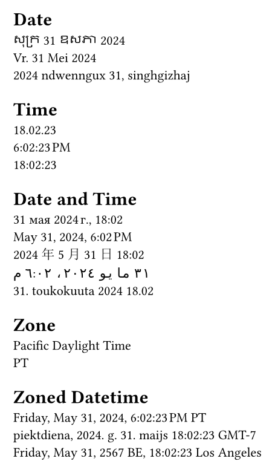

# icu-datetime

<!-- markdownlint-disable-file MD033 -->
<!-- markdownlint-configure-file { "no-duplicate-heading": { "siblings_only": true } } -->

This library is a wrapper around [ICU4X](https://github.com/unicode-org/icu4x)' `datetime` formatting for Typst which provides internationalized formatting for dates, times, and timezones.

As the WASM bundle includes all localization data, it's quite large (about 8 MiB).

See [nerixyz.github.io/icu-typ](https://nerixyz.github.io/icu-typ) for a full API reference with more examples.

## Example

```typ
#import "@preview/icu-datetime:0.2.0" as icu

#let day = datetime(
  year: 2024,
  month: 5,
  day: 31,
)
#let time = datetime(
  hour: 18,
  minute: 2,
  second: 23,
)
#let dt = datetime(
  year: 2024,
  month: 5,
  day: 31,
  hour: 18,
  minute: 2,
  second: 23,
)
#let tz = (
  offset: "-07",
  iana: "America/Los_Angeles",
  zone-variant: "st", // standard
)

= Date
#icu.fmt(day, locale: "km", date-fields: "YMDE") \
#icu.fmt(day, locale: "af", date-fields: "YMDE") \
#icu.fmt(day, locale: "za", date-fields: "YMDE") \

= Time
#icu.fmt(time, locale: "id", time-precision: "second") \
#icu.fmt(time, locale: "en", time-precision: "second") \
#icu.fmt(time, locale: "ga", time-precision: "second") \

= Date and Time
#icu.fmt(dt, locale: "ru", length: "long") \
#icu.fmt(dt, locale: "en-US", length: "long") \
#icu.fmt(dt, locale: "zh-Hans-CN", length: "long") \
#icu.fmt(dt, locale: "ar", length: "long") \
#icu.fmt(dt, locale: "fi", length: "long")

= Timezone
#icu.fmt(
  datetime.today(),
  zone: tz,
  zone-style: "specific-long",
) \
#icu.fmt(
  datetime.today(),
  zone: tz,
  zone-style: "generic-short",
)

= Zoned Datetime
#let opts = (
  zone: tz,
  date-fields: "YMDE",
  time-precision: "second",
  length: "long",
)

#icu.fmt(dt, ..opts, zone-style: "generic-short") \
#icu.fmt(dt, ..opts, zone-style: "localized-offset-short", locale: "lv") \
#icu.fmt(dt, ..opts, zone-style: "exemplar-city", locale: "en-CA-u-hc-h24-ca-buddhist")
```

<!-- typst c res/example.typ res/example.png --root . -->



Locales must be [Unicode Locale Identifier]s.
Use [`locale-info(locale)`](https://nerixyz.github.io/icu-typ/locale-info/) to get information on how a locale is parsed.
Unicode extensions are supported, so you can, for example, set the hour cycle with `hc-h12` or set the calendar with `ca-buddhist` (e.g. `en-CA-u-hc-h24-ca-buddhist`).

## Documentation

Documentation can be found on [nerixyz.github.io/icu-typ](https://nerixyz.github.io/icu-typ).

## Using Locally

Download the [latest release](https://github.com/Nerixyz/icu-typ/releases), unzip it to your [local Typst packages](https://github.com/typst/packages#local-packages), and use `#import "@local/icu-datetime:0.2.0"`.

## Building

To build the library, you need to have [Rust](https://www.rust-lang.org/), [just](https://just.systems/), and [`wasm-opt`](https://github.com/WebAssembly/binaryen) installed.

```sh
just build
# to deploy the package locally, use `just deploy`
```

While developing, you can symlink the WASM file into the root of the repository (it's in the `.gitignore`):

```sh
# Windows (PowerShell)
New-Item icu-datetime.wasm -ItemType SymbolicLink -Value ./target/wasm32-unknown-unknown/debug/icu_typ.wasm
# Unix
ln -s ./target/wasm32-unknown-unknown/debug/icu_typ.wasm icu-datetime.wasm
```

Use `cargo b --target wasm32-unknown-unknown` to build in debug mode.

[Unicode Locale Identifier]: https://unicode.org/reports/tr35/tr35.html#Unicode_locale_identifier
